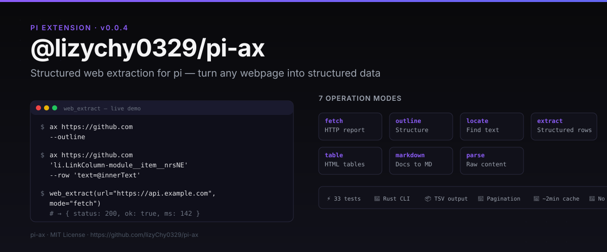
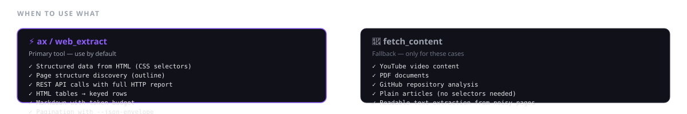
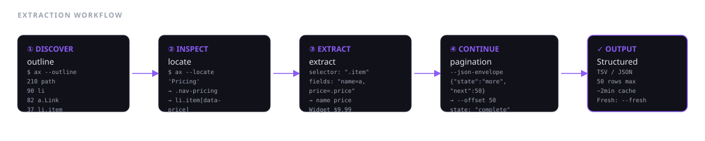

# @lizychy0329/pi-ax

**ax 集成包 for pi** — 结构化网页提取，无需写任何解析脚本。

> [ax](https://github.com/yusukebe/ax) is a Rust CLI built for fast, token-cheap web extraction. This package wraps it as a **pi extension** — giving your agent a `web_extract` tool with 7 operation modes, plus a skill that tells the agent when to use it vs `fetch_content`.

---

## 项目简介与技术栈

| 项目 | 说明 |
|---|---|
| **ax CLI** | [Rust](https://github.com/yusukebe/ax) — 底层提取引擎，支持 7 种模式、CSS 选择器、TSV 输出、URL 缓存 |
| **web_extract 工具** | TypeScript — 将 ax CLI 封装为 pi 结构化参数工具，注册为 `web_extract` |
| **SKILL** | Markdown — 指导 agent 何时用 ax、何时用 fetch_content |
| **自动安装** | 首次使用时自动检测环境，缺失则从 [ax 官方](https://github.com/yusukebe/ax/releases/latest) 下载二进制到 `~/.pi/agent/bin/`（无需 sudo） |
| **测试** | Vitest — 33 单元测试 + 7 集成测试，覆盖全部 mode 分支和可选参数 |

### 架构

```
pi Agent (LLM)
    │
    ├── web_extract 工具 ─── buildAxArgs(params) ─── spawnSync("ax", args)
    │         │                              │
    │         └── TypeBox schema             └── Rust ax CLI (7 modes)
    │
    └── SKILL ─── 决策指南：何时 ax、何时 fetch_content
```

---

## 快速开始

### 安装

```bash
# 从 npm 安装（推荐）
pi install npm:@lizychy0329/pi-ax

# 或从 GitHub 安装
pi install git:github.com/lizyChy0329/pi-ax
```

安装后，pi 会自动：
1. 检测 `ax` 是否已安装
2. 若未安装，自动下载 ax 二进制到 `~/.pi/agent/bin/`（**无需 sudo**）
3. 注册 `web_extract` 工具和 `ax` skill

### 第一个请求

告诉 agent：

> "提取 https://github.com 页面上所有导航链接的标题"

agent 会自动调用：
```json
{
  "url": "https://github.com",
  "mode": "extract",
  "selector": "a[href]",
  "fields": "title=@innerText"
}
```

### 本地开发

```bash
git clone https://github.com/lizyChy0329/pi-ax
cd pi-ax
npm install

# 运行测试
npm test

# 临时加载（开发模式）
pi -e ./src/index.ts
```

---

## 为什么需要他？

- **不用写解析脚本**：过去要从 HTML 提取数据得写正则或 DOM 解析，现在只要一个 `web_extract` 调用
- **Token 便宜**：默认 TSV 输出，约为 JSON 的 1/3 token
- **7 种模式，一个工具**：HTTP 报告、结构发现、文本定位、结构化提取、表格提取、Markdown 转换、原始解析
- **自动安装**：不用手动装 ax，缺失时自动从官网下载
- **Skill 决策**：告诉 agent 什么场景用 ax、什么场景用 fetch_content，避免工具选择混乱

---

## 能做什么？不能做什么？



### ✅ web_extract 能做

| 模式 | 场景 | 示例 |
|---|---|---|
| `fetch` | REST API 调用、HTTP 调试 | `fetch(url, method="POST", body='{"a":1}')` |
| `outline` | 页面结构发现（提取前先探查） | `outline(url)` → tag.class 模式计数 |
| `locate` | 找某段文本的 CSS 选择器 | `locate(url, query="Pricing")` → `.nav-pricing` |
| `extract` | 结构化行提取（列表、卡片、搜索结果） | `extract(selector=".card", fields="title=a, href=a@href")` |
| `table` | HTML `<table>` → 键值行 | `table(selector="table")` → 列名来自 `<th>` |
| `markdown` | 文档页 → 可读 Markdown（支持 token 预算） | `markdown(url, budget=800)` |
| `parse` | 原始页面内容（带 ~2min URL 缓存） | `parse(url, fresh=true)` 绕过缓存 |

### ❌ 不该用 web_extract

| 场景 | 改用 |
|---|---|
| YouTube 视频内容 | `fetch_content` |
| PDF 文档 | `fetch_content` |
| GitHub 仓库分析 | `fetch_content` |
| 纯文章阅读（无需 CSS 选择器） | `fetch_content` |

---

## 工作流：从未知页面提取数据



**步骤 1：发现结构** → `web_extract` mode: `outline`

```
$ ax https://example.com --outline
 210  path
  90  li
  82  a.Link
  37  li.item
```

**步骤 2：定位选择器** → `web_extract` mode: `locate`

```
$ ax https://example.com --locate "Pricing"
→ .nav-pricing
```

**步骤 3：结构化提取** → `web_extract` mode: `extract`

```json
{ "url": "https://example.com", "mode": "extract",
  "selector": ".item", "fields": "name=a, price=.price" }
```

**步骤 4：分页继续** → `envelope: true` + `offset`

```json
{ "url": "https://example.com", "mode": "extract",
  "selector": ".item", "fields": "name=a",
  "limit": 20, "envelope": true }
```

Aim for ≤3 tool calls. The 2-minute URL cache makes repeated probes free.

### 常见陷阱

- **`<a>` 自身做 row selector**：字段 `a` 在 `<a>` 内找不到子元素 → 空。用父容器作 row selector。
- **HTTPS→HTTP 跳转**：百度等站点强制降级，直接用 `http://`。
- **单行压缩 HTML**：`--outline` 效果差，用 `--fresh` 或 Python 格式化。

---

## 相关资源链接

| 资源 | 链接 |
|---|---|
| ax 官方项目 | [github.com/yusukebe/ax](https://github.com/yusukebe/ax) |
| ax 安装脚本 | [ax.yusuke.run/install](https://ax.yusuke.run/install) |
| ax 最新发布 | [github.com/yusukebe/ax/releases/latest](https://github.com/yusukebe/ax/releases/latest) |
| 本包源码 | [github.com/lizyChy0329/pi-ax](https://github.com/lizyChy0329/pi-ax) |
| pi-coding-agent | [pi-coding-agent](https://github.com/earendil-works/pi-coding-agent) |
| TypeBox | [github.com/sinclairzx81/typebox](https://github.com/sinclairzx81/typebox) |
| Vitest | [vitest.dev](https://vitest.dev) |

---

## License

[MIT](LICENSE)
